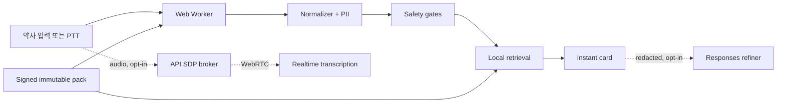

# Architecture

핵심 결정은 단순하다. 임상 안전 판단은 네트워크와 모델에서 분리한다. 브라우저 Worker와 API가 같은 결정론적 core를 사용한다.

우선순위는 safety → privacy → provenance → correctness → latency다. Safety와 retrieval은 OpenAI·DB·network에 의존하지 않는다. observability는 content-free allowlist만 받는다. Reviewer는 서명하지 않으며 publisher 권한 API를 거쳐야 한다.

데이터 흐름은 `RuntimeInput` schema → normalize/redact → ordered safety gate → exact/trie/rule/BM25/trigram → `RuntimeOutput` schema 순서다. critical state는 확인 전 교체하지 않는다. sequence가 오래된 결과는 버린다.

Production 시작 시 synthetic/placeholder, invalid signature, expired/revoked/conflicted/unapproved pack을 거부한다. 현재 dev pack은 ephemeral dev key로 서명되며 clinical-use-prohibited flag가 고정된다.
