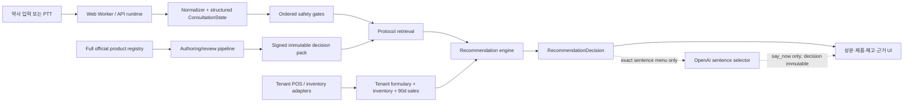

# Architecture

핵심 원칙은 **임상 결정은 결정론적 로컬 엔진이 만들고, 모델은 이미 고정된 결정을 한 문장으로만 표현한다**는 것이다. 브라우저 Worker와 API는 같은 runtime/recommendation 코어와 같은 활성 지식팩을 사용한다. 네트워크, LLM 또는 외부 데이터베이스 장애가 이미 계산된 안전 결정과 추천 결정을 바꾸지 못한다.

## 분리된 데이터 경계

1. **전체 registry**: MFDS 제품·성분·DUR·e약은요의 정규화된 authoring 데이터다. 런타임 LLM context에 전체 registry를 넣지 않는다.
2. **검토된 pack**: source snapshot, clinical claim, protocol, option, rule, ingredient, product link를 약사 검토 후 compile/sign한 immutable artifact다.
3. **tenant 운영 데이터**: formulary, 현재 재고, 최근 90일 판매 집계 및 POS crosswalk다. `tenant_id`와 활성 `pack_id`로 격리하며 환자 식별 열은 수집하지 않는다.
4. **상담별 retrieved context**: 안전 gate를 통과한 protocol과 최대 3개 ingredient option, 최대 5개 tenant product candidate만 사용한다.

## 런타임 순서

`RuntimeInput` → normalize/redact → ConsultationState merge → ordered safety gate → protocol retrieval → eligibility/exclusion → verified ingredient selection → tenant formulary mapping → 재고 필터 → ranking → `RecommendationDecision` → `RuntimeOutput` 순서다.

정렬 우선순위는 **임상 적합성 → 안전 → 재고 → 판매 다빈도 → 안정적 ID tie-break**다. 판매량이나 마진은 eligibility, exclusion, 임상 점수 또는 안전 점수를 변경할 수 없다.

`RecommendationDecision.status` 의미:

- `recommend`: 활성 pack의 검증된 ingredient option이 필수다. inventory가 연결되면 가용 tenant product candidate도 필수다.
- `ask`: 실제 option 선택을 바꾸는 질문 하나만 허용한다. `ConsultationState.asked_slots`에 있는 질문은 반복하지 않는다.
- `refer`: red flag 또는 protocol rule에 의해 직접 평가가 우선이며 ingredient/product candidate는 비어 있다.
- `insufficient`: 활성 pack과 tenant 데이터만으로 검증된 결정을 만들 수 없으며 일반 의약지식으로 빈칸을 보완하지 않는다.

## 지식팩과 provenance

모든 추천 ingredient, product, claim, protocol은 같은 `pack_id`에 속하고, pack에 포함된 `SourceSnapshot.source_snapshot_id`와 locator를 갖는다. source → claim → protocol → review → compile → sign 순서를 건너뛸 수 없다. 자동 추출물은 candidate 상태로만 저장한다.

Production 시작 및 모든 publish/rollback/revocation fallback에서 다음을 다시 검사한다.

- 유효한 Ed25519 서명과 immutable payload hash
- non-synthetic, `clinicalUseProhibited=false`, `verified=true`
- pack/protocol/review/source 만료 여부
- pharmacist approval과 official-source verification
- source 이용권한, commercial use, cache, redistribution, AI-context 권한
- withdrawn/discontinued/blocked product 및 DUR 차단 제거
- unresolved conflict, revoked entity, domain leak 없음

private signing key는 repo, client bundle, 결과 artifact 또는 일반 CI 산출물에 두지 않는다. runtime에는 public verification key만 배포한다.

## OpenAI 경계

OpenAI adapter는 `RecommendationDecision`을 생성하거나 수정하지 않는다. 로컬 출력에서 만든 소수의 정확한 한국어 문장 enum 중 하나만 선택할 수 있다. 응답 후 request/session/sequence, decision, 질문, red flag, action, source ref, pack version을 byte-equivalent projection으로 비교한다. 모델·timeout·schema 오류 시 원래 instant output을 유지한다.

우선순위는 safety → privacy → provenance → correctness → latency다. observability는 content-free allowlist만 받으며 raw audio, transcript, 환자 식별정보, source dump를 저장하지 않는다.
