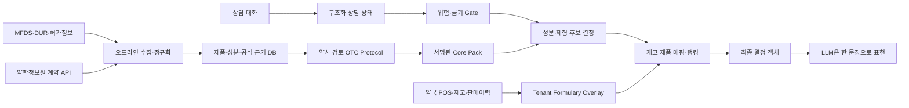

# PharmAssist 일반의약품 데이터·추천 구조 재설계 브리프

이 문서는 웹에서 실행되는 Pro 모델에 업로드할 자료다. Pro는 사용자 컴퓨터나 `C:\dev` 경로에 접근할 수 없다. 함께 업로드된 `repository/` 스냅샷만 현재 프로젝트의 사실로 사용해야 한다.

## 먼저 해결할 문제

지금 PharmAssist는 환자 말을 짧게 정리하고 다음 질문을 고르는 데는 가까워졌지만, 상담의 끝에서 “그래서 어떤 성분이나 제품을 고려할지”를 안정적으로 결정하지 못한다. 모델이 “일반의약품을 제시할게요”라고 말한 뒤 끝나는 것도 같은 문제다.

원인은 모델 성능보다 데이터와 출력 계약에 있다.

- 현재 활성 지식팩은 증상 중심 synthetic 카드 9개뿐이다.
- 제품·성분·근거 claim·공식 source가 런타임 지식팩에 없다.
- `RuntimePack`은 사실상 `cards`만 가진다.
- 로컬 엔진은 정상 입력도 대부분 `clarify`로 끝낸다.
- 최종 출력 스키마에는 `recommend`라는 결정 상태가 없다.
- API manifest도 `products: 0`, `claims: 0`, `sources: 0`을 반환한다.
- 프롬프트는 한쪽에서 구체 성분을 말하라고 하고, 다른 쪽에서는 성분을 만들지 말라고 한다.

따라서 프롬프트를 더 세게 쓰는 방식으로는 고칠 수 없다. 필요한 구조는 “LLM 상담 챗봇”이 아니라 **검증된 OTC 결정엔진 + 약국별 재고·다빈도 랭킹 + 짧은 문장화 모델**이다.

## 업로드 묶음과 현재 구조

ZIP을 풀면 다음 구조가 보인다.

```text
00_START_HERE.txt       # Pro에 전달할 실행 프롬프트
01_PROJECT_BRIEF.md     # 이 문서
02_UPLOAD_MANIFEST.md   # 포함·제외 기준
FILE_LIST.txt           # 실제 포함 파일
repository/             # 현재 프로젝트 스냅샷
  app/                  # 실제 TypeScript monorepo
```

이 문서 안의 `app/...` 경로는 ZIP 내부 `repository/app/...`를 뜻한다. 로컬 절대경로를 찾거나 사용자에게 다시 업로드해달라고 요청하지 말고, 먼저 제공된 파일을 모두 활용한다.

먼저 볼 파일:

```text
app/packages/runtime/src/index.ts
app/packages/retrieval/src/index.ts
app/packages/safety/src/index.ts
app/packages/knowledge/src/index.ts
app/packages/test-fixtures/src/index.ts
app/packages/openai-adapter/src/index.ts
app/packages/contracts/schemas/runtime_output.schema.json
app/spec/schemas/drug_product.schema.json
app/spec/schemas/claim.schema.json
app/spec/schemas/consultation_card.schema.json
app/tools/ingest/src/index.ts
app/apps/api/src/app.ts
app/docs/ARCHITECTURE.md
app/docs/KNOWLEDGE_AUTHORING.md
app/data/README.md
```

이미 있는 기반은 살린다.

- signed immutable knowledge pack
- source → claim → card → review → pack 개념
- 제품 스키마 초안
- 안전 gate
- exact/trie/BM25/trigram 검색
- OpenAI 결과 스키마 검증
- production에서 synthetic pack 차단

새 프로젝트로 다시 만들 필요는 없다. 비어 있는 제품·성분·protocol·추천 결정 계층을 연결하면 된다.

## 전체 구조



중요한 경계가 있다.

- 전체 제품정보는 DB에 저장할 수 있다.
- 추천 가능한 제품군은 약사가 검토한 formulary로 좁힌다.
- 한 상담의 모델 context에는 관련 protocol 1개, 성분 후보 3~~5개, 재고 제품 3~~5개만 넣는다.
- LLM은 후보를 만들거나 안전 결정을 뒤집지 못한다.

## 어떤 데이터가 필요한가

### 1. `SourceSnapshot`

공식 데이터가 언제, 어디서, 어떤 내용으로 들어왔는지 남긴다.

필수 필드:

- `source_id`
- `provider`
- `dataset`
- `retrieved_at`
- `effective_at`
- `locator`
- `license_id`
- `content_sha256`
- `parser_version`
- `status`

### 2. `Ingredient`

제품명이 바뀌어도 임상 규칙이 유지되도록 성분을 독립 엔터티로 둔다.

- 내부 `ingredient_id`
- 한글명·영문명·동의어
- 표준 성분코드
- 작용/상담용 분류
- 제형·투여경로
- 중복 성분 그룹

### 3. `DrugProduct`

기존 `drug_product.schema.json`을 확장한다.

- 품목기준코드와 가능한 표준코드
- 제품명·업체명
- 일반/전문 구분
- 허가·취하·단종 상태
- 성분과 함량
- 제형·경로
- 공식 효능·효과
- 용법·용량 원문과 구조화 값
- 사용상 주의사항
- 상호작용·부작용·보관법
- 공급실적 존재 여부
- source refs

### 4. `ClinicalClaim`

런타임 문구를 원문 전체가 아니라 검증 가능한 작은 사실로 쪼갠다.

- 대상 제품/성분
- claim type
- 짧은 정규화 문장
- 적용 인구·제형·경로
- 금기·주의 조건
- source locator
- 검토자·검토일·만료일
- 승인·충돌·폐기 상태

### 5. `OTCProtocol`

증상 카드와 제품 사이를 연결하는 핵심 엔터티다.

- 상담 intent
- 적용 조건
- 즉시 의뢰해야 하는 red flags
- 실제 선택을 바꾸는 필수 slot
- 질문 우선순위
- 질문 예산
- 가능한 `ProtocolOption`
- 결과를 막는 조건
- self-care 안내
- 근거 claim IDs
- 약사 검토 상태

### 6. `ProtocolOption`

브랜드가 아니라 성분·제형 조합을 먼저 결정한다.

- 성분 또는 성분 그룹
- 제형·투여경로
- 선택 조건
- 제외 조건
- 필수 확인사항
- 동일성분 중복 규칙
- 제품 매핑 규칙
- 우선순위가 아니라 임상 적합도

### 7. `TenantFormulary`

약국마다 실제 취급 제품이 다르므로 공통 지식팩과 분리한다.

- `tenant_id`
- `product_id`
- 취급 여부
- 현재 재고
- 최근 입고일
- 품절·단종 표시
- 약사 승인 상태
- 대체 제품 그룹

### 8. `TenantSalesAggregate`

판매량은 임상 적합도를 결정하지 않는다. 안전·적합성 필터를 통과한 제품 사이에서 재고 가능성과 익숙함을 반영하는 보조 점수로만 쓴다.

- 최근 30/90/180일 판매수량
- 판매일수
- 반품수량
- 품절일수
- 마지막 판매일
- 카테고리별 percentile

### 9. `RecommendationDecision`

최종 출력은 문장이 아니라 먼저 구조화된 결정이어야 한다.

```ts
interface RecommendationDecision {
  status: "recommend" | "ask" | "refer" | "insufficient";
  protocolId: string | null;
  ingredientOptions: IngredientOption[];
  productCandidates: ProductCandidate[];
  rationaleCodes: string[];
  exclusions: Exclusion[];
  sourceRefs: SourceRef[];
  question: Question | null;
  selfCare: string[];
}
```

규칙:

- `recommend`이면 검증된 성분 후보가 반드시 있어야 한다.
- 재고가 연결된 약국에서는 제품 후보도 있어야 한다.
- `ask`는 답이 실제 성분·제품 선택을 바꾸는 질문 1개만 허용한다.
- `refer`에서는 제품 후보를 출력하지 않는다.
- 제품·성분 ID는 활성 지식팩 안에 있어야 한다.
- 모든 추천에는 source refs가 있어야 한다.
- LLM은 `RecommendationDecision`을 변경하지 못한다.

## 공식 데이터 소스

### 우선 구현: MFDS 공공 API

1. 의약품개요정보 `e약은요`
   - 일반의약품 중 공급실적이 있는 제품의 제품명, 효능, 사용법, 주의사항, 상호작용, 부작용, 보관법
   - 초기 OTC 제품 모집단으로 사용
   - https://www.data.go.kr/data/15075057/openapi.do
   - 서비스 URL: `http://apis.data.go.kr/1471000/DrbEasyDrugInfoService`

2. 의약품 제품 허가정보
   - 품목기준코드, 유효성분, 업체, 허가상태, 제형 등 정규화
   - 2025년 변경된 `DrugPrdtPrmsnInfoService07` 기준 확인
   - https://www.data.go.kr/bbs/ntc/selectNotice.do?originId=NOTICE_0000000004363

3. DUR 품목정보
   - 병용금기, 연령금기, 임부금기, 노인주의, 용량·기간주의, 효능군 중복
   - https://www.data.go.kr/data/15059486/openapi.do

4. DUR 성분정보
   - 성분 단위 안전정보와 관계성분
   - https://www.data.go.kr/data/15056780/openapi.do

공공 API key가 없더라도 adapter, 계약, fixture, 동기화 runbook을 완성할 수 있다. 임의 웹 크롤링으로 대체하지 않는다.

### 선택 구현: 약학정보원

약학정보원은 기본의약품정보, 식별정보, 복약정보, 성분정보 DB를 운영한다. 다만 공개 웹페이지를 긁어 제품 DB를 만들지 않는다. API Center를 통해 계약 범위를 먼저 확인한다.

- 주요사업: https://health.kr/company/business.asp
- API 문의: https://api.health.kr/mail

문의할 항목:

- 상업적 사용 가능 여부
- 서버·로컬 앱 캐시 허용 범위
- 정규화·파생 데이터 생성 권리
- Windows 앱용 signed pack 재배포 허용 여부
- AI 입력 context와 결과 화면 사용 허용 여부
- 호출량, delta feed, 갱신 주기, SLA
- 품목기준코드·보험코드·표준코드 crosswalk
- 계약 종료·제품 취하 시 데이터 삭제 조건

약학정보원 계약은 구조의 필수 전제가 아니다. `HealthKrAdapter`를 provider interface 뒤에 두고, MFDS adapter만으로 먼저 작동해야 한다.

## 다빈도 제품은 어떻게 고를까

“전국에서 많이 팔리는 약 100개”를 임의로 고르면 안 된다. 약국별 재고와 상권이 다르고, 많이 팔린다는 사실이 환자에게 적합하다는 뜻도 아니기 때문이다.

제품 수가 아니라 coverage를 기준으로 정한다.

1. `e약은요`에서 공급실적 있는 일반의약품 모집단을 만든다.
2. 허가취하·단종·DUR 차단 제품을 제거한다.
3. 약국 POS의 최근 90일 일반약 판매를 품목기준코드에 매핑한다.
4. 누적 판매의 85~90%를 덮는 제품을 기본 formulary 후보로 삼는다.
5. 감기·알레르기·통증·소화기·피부 등 카테고리별 최소 coverage를 보장한다.
6. 약사가 최종 활성화한다.
7. 런타임에서는 `임상 적합성 → 안전 → 재고 → 약국 다빈도` 순으로 정렬한다.

POS API가 없으면 첫 단계는 CSV import로 충분하다.

```text
tenant_id,product_code,display_name,on_hand_qty,sales_90d,last_sold_at,enabled
```

## 런타임 동작

1. 대화 전체를 `ConsultationState`로 누적한다.
2. 최신 발화가 수정·부정·짧은 답인지 기존 상태에 병합한다.
3. red flag와 금기 gate를 먼저 실행한다.
4. 관련 OTC protocol을 찾는다.
5. 아직 필요한 정보가 있으면 선택을 가장 크게 바꾸는 질문 하나만 낸다.
6. 충분하면 성분·제형 후보를 결정한다.
7. 해당 약국 formulary에서 실제 제품을 매핑한다.
8. `RecommendationDecision`을 고정한다.
9. LLM은 약사가 환자에게 바로 말할 한 문장으로만 바꾼다.

OpenAI가 실패해도 8단계까지 로컬에서 끝나야 한다. LLM이 없으면 문장 템플릿을 사용한다.

## 구현 위치

아래 경로는 업로드된 `repository/`를 기준으로 한다. Pro는 수정본을 같은 상대경로로 만들어 결과 ZIP에 담는다.

권장 변경:

```text
packages/contracts
  제품·성분·protocol·formulary·decision JSON Schema

tools/ingest
  mfds-easy-drug adapter
  mfds-product-permit adapter
  mfds-dur-product adapter
  mfds-dur-ingredient adapter
  optional healthkr adapter
  POS CSV adapter

packages/knowledge
  source snapshot, claim provenance, review, pack compile/sign

packages/retrieval
  protocol·ingredient·product index

packages/recommendation
  새 패키지. 결정 규칙, exclusion, product ranking

packages/runtime
  consultation state → safety → protocol → decision

apps/api
  pack manifest 실제 counts
  formulary import/activation
  OpenAI에는 고정된 결정만 전달

apps/web
  최종 성분·제품 후보, 근거, 재고상태 표시
```

원본 source dump와 signing private key는 Git에 넣지 않는다. 수집기는 외부 authoring storage를 사용하고, 저장소에는 schema·adapter·작은 synthetic fixture·검증된 결과물 구조만 둔다.

## 반드시 통과할 테스트

- “제시할게요”, “안내할게요”, “확인해볼게요”처럼 행동을 예고하고 끝나는 답변 0건
- 일반 OTC 상담의 최종 상태가 `recommend | ask | refer | insufficient` 중 하나
- `recommend`인데 성분 후보가 없는 결과 0건
- 활성 pack에 없는 성분·제품 출력 0건
- source ref 없는 추천 0건
- red flag가 있으면 추천 제품 0개
- 금기·연령·임신·병용 gate 우회 0건
- 질문은 한 turn에 최대 1개
- 이미 답한 질문 반복 0건
- 재고 0·비활성·단종 제품 추천 0건
- LLM·네트워크 장애 시 로컬 결정 유지
- synthetic·미검토·만료 pack은 production 활성화 불가
- 기존 개인정보·보안·E2E 테스트 유지

대표 회귀 대화에는 기침, 콧물, 인후통, 속쓰림, 소화불량, 설사·변비, 근육통, 피부 증상, 발열을 포함한다. 약사가 검토하지 않은 임상 규칙은 production claim으로 만들지 않는다.

## 이번 작업의 완료 기준

설계 문서만 만드는 것으로 끝내지 않는다. Pro는 업로드된 스냅샷을 직접 수정한 결과물을 다운로드 가능한 ZIP으로 반환한다.

- 실제 schema와 migration이 있다.
- 공공 API adapter와 POS CSV adapter가 실행된다.
- synthetic fixture로 end-to-end pack build가 된다.
- 로컬 엔진이 LLM 없이 `RecommendationDecision`을 만든다.
- OpenAI는 결정 내용을 넘어서는 제품·성분을 출력하지 못한다.
- manifest counts가 실제 products·ingredients·claims·protocols 수를 보여준다.
- unit/integration/E2E와 대표 상담 회귀 테스트가 통과한다.
- credential이나 약사 승인 없이는 production-ready라고 주장하지 않는다.

웹 환경에서 테스트 실행이 불가능하면 실행했다고 쓰지 않는다. 대신 로컬에서 그대로 실행할 명령, 예상 gate, 미검증 항목을 분리한다.

## Pro가 반환할 결과물

결과 파일명:

```text
PharmAssist-Pro-Result.zip
```

필수 구성:

```text
RESULT_SUMMARY.md              # 핵심 결론, 변경 구조, 남은 위험
SOURCE_RESEARCH.md             # 공식 출처·API·계약·필드 조사
SOURCE_CONTRACT_MATRIX.csv     # provider별 license/cache/redistribution 상태
DATA_MODEL.md                  # 엔터티·관계·식별자·provenance
IMPLEMENTATION_PLAN.md         # 적용 순서와 migration 전략
VALIDATION_PLAN.md             # 약사 검토·golden case·실행 명령
changed-files/                 # 수정·신규 파일, repository 기준 상대경로 유지
PATCH_MANIFEST.md              # 각 파일 변경 이유와 의존 관계
```

Pro가 코드를 완성하지 못하더라도 빈 껍데기나 의사코드로 완료 처리하지 않는다. 구현된 부분, 설계만 된 부분, credential·계약·약사 검토로 막힌 부분을 명확히 나눈다.

Reference basis: tossfeed 대출 핵심 개념 설명·비교형 글쓰기 흐름
